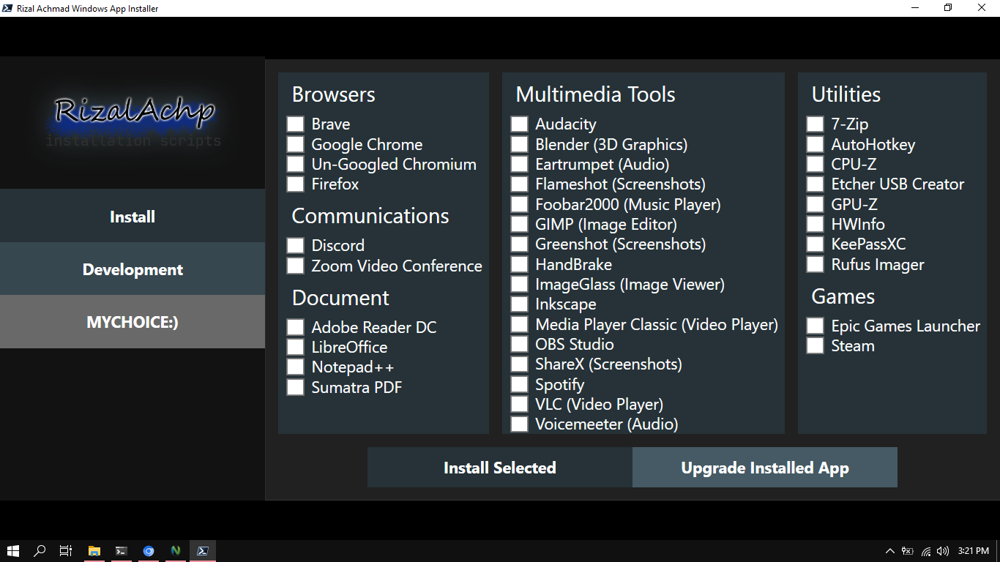

# App Installer Script for Windows

## HOW TO USE
**run this on powershell**
```powershell
Set-ExecutionPolicy Unrestricted -Force
```
**then, just run this on your powershell:**
```powershell
iwr -useb https://raw.githubusercontent.com/RizalAchp/rz-winscripts/master/install.ps1 | iex
```

---
## Problem
if you encounter error popup **"program 'winget' is not installed in this machine! install it first!"**
install [winget](https://github.com/microsoft/winget-cli) on your windows machine
if the command above cannot run, run command:
and run again
---
